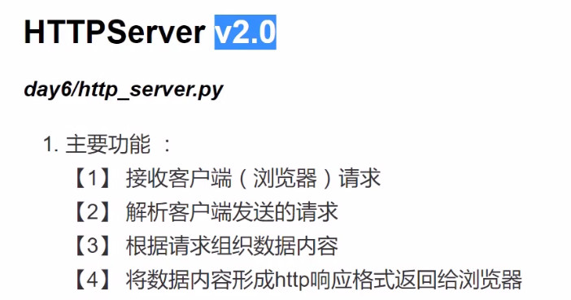
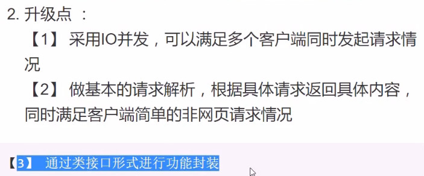
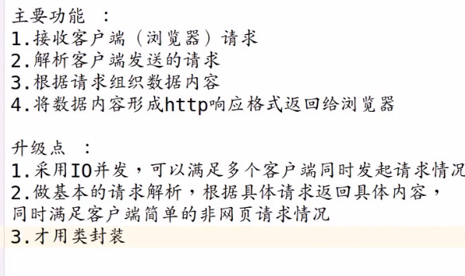
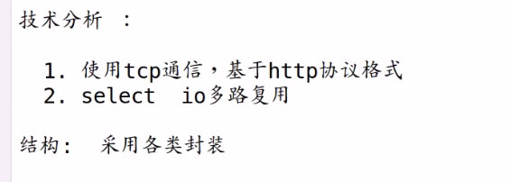
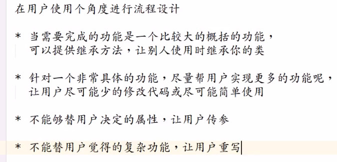

## 网络编程总结：


# 练习










```python
"""
httpserver v2.0
io多路复用和HPPT训练
"""
from select import select
from socket import *


#具体功能实现
class Httpserver:
    def __init__(self,host='0.0.0.0',port=8000,dri='./statuc'):
        self.lst = []
        self.text1 = 'HTTP/1.1 200 ok\r\n'
        self.text1 = self.text1 +'Content-Type: text/html\r\n\n'

        self.text2 ="HTTP/1.1 404 Not Found\r\n"
        self.text2 =self.text2 +'Content-Type: text/html\r\n\n'
        self.host =host
        self.port =port
        self.dir = dri
        self.address=(self.host,self.port)
        #多路复用列表
        self.rlist = []
        self.wlis = []
        self.xlist= []
        #实例化对象时直接创建按套接字
        self.create_socket()
        self.bind()

    def create_socket(self):
        self.socket=socket()
        self.lst.append(self.socket.fileno())
        self.socket.setsockopt(SOL_SOCKET,SO_REUSEADDR,1)

    def bind(self):
        self.socket.bind(self.address)

    #启动服务
    def server_forever(self):
        self.socket.listen(3)
        print('liste the port %d'%self.port)
        #IO多路复用接收客户端请求
        self.rlist.append(self.socket)
        self.lst.append((self.socket.fileno(),'socket'))

        while True:
            rs,ws,xs = select(self.rlist,self.wlis,self.xlist)
            for r in rs:
                if r is self.socket:
                    c,addr = r.accept()
                    print('connect form ',addr)
                    self.rlist.append(c)
                else:
                    self.handle(r)


    def handle(self,client):
        #接收HTTP请求
        request = client.recv(4096).decode()
        #请求断开
        if not request:
            self.rlist.remove(client)
            client.close()
            return

            #提取请求
        # print(request,3333333333333333333333333333333333333)
        # request_line = request.splitlines()[0]#splitlines分成行
        # request_line = request.split(' ')[1]
        # print(request_line,55555)
        # info = request_line.split(' ')[1]
        info =  request.split(' ')[1]
        self.lst.append((client.fileno(),info))


        # print(client,client.getpeername(),':',info[0],2222222222222222222222222)#getpeername() 套字节的地址 address
        #根据请求进行分类
        #分两类1.请求网页 2 请求其他
        if info == '/favicon.ico':
            self.rlist.remove(client)
            client.close()
            return
        elif info[0] =='/' or info[-5:] == '.html':
            self.get_html(client,info,)
        else:
            self.get_data(client)
    #返回网页
    def get_html(self,client,info):
        # print('返回网页')
        if info=='/':
            file = self.dir+'/index.html'
        elif len(info)>1 and '.html' not in info:
            file = self.dir +info +'/index.html'

        else:
            file = self.dir+info

        try:

            data = open(file,'r',encoding='utf-8')
        except Exception:
            data1 =self.text1 +'没有相应网页'

            # self.get_data(client)
        else:
            print('给客户端数据')
            data1 = self.text1 + data.read()
            data.close()
        finally:
            client.send(data1.encode())
        i=1
        for item  in self.lst:
            print(i,item)
            i +=1
    #其他数据
    def get_data(self,client):
        print('其他数据')
        data = self.text1+'hello'
        print(data)
        client.send(data.encode())
        print(client)


if __name__=="__main__":
    """
    通过HTTPserver类快速搭建服务，展示自己的网页
    """
    #用户决定的参数
    HOST='0.0.0.0'
    PROT =9000
    DIR ='./httpserver'
    httpd = Httpserver(HOST,PROT,DIR)#实例化对象
    httpd.server_forever()#启动服务

```

